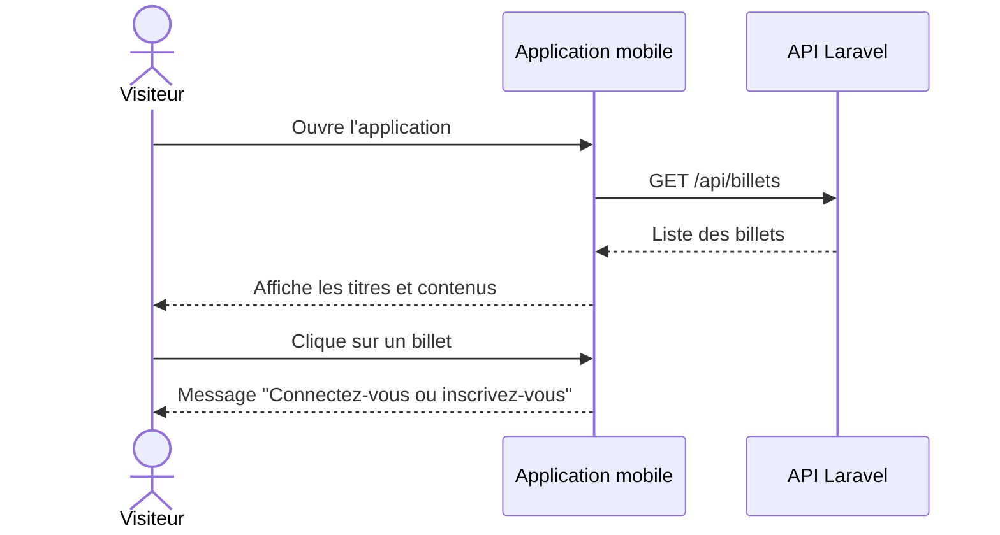
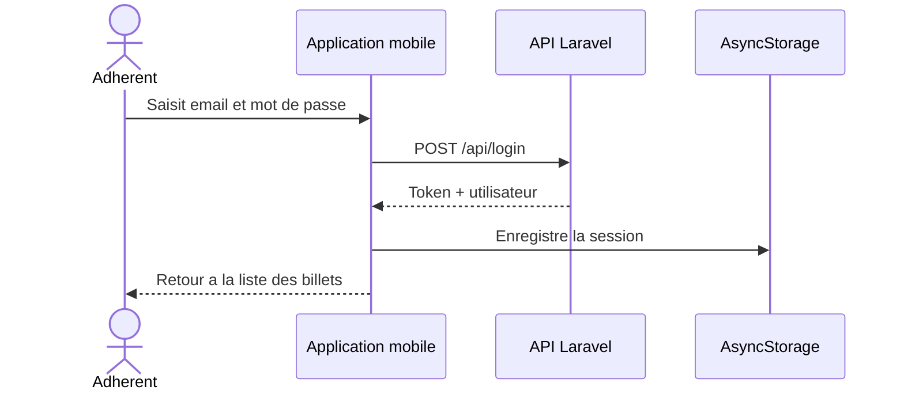
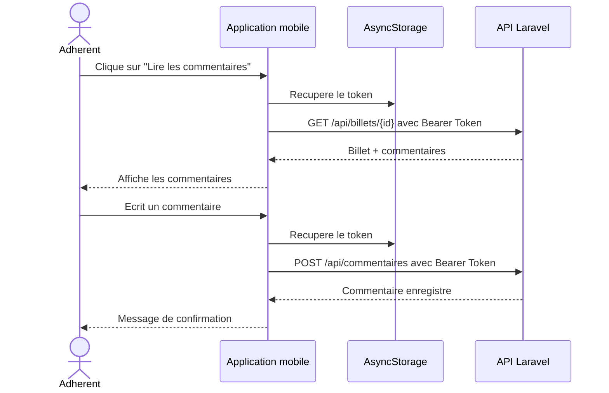
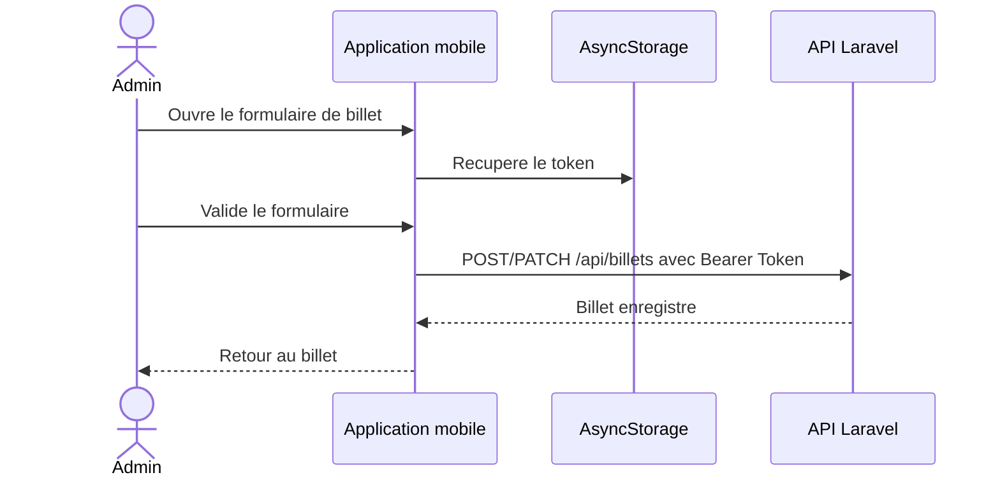
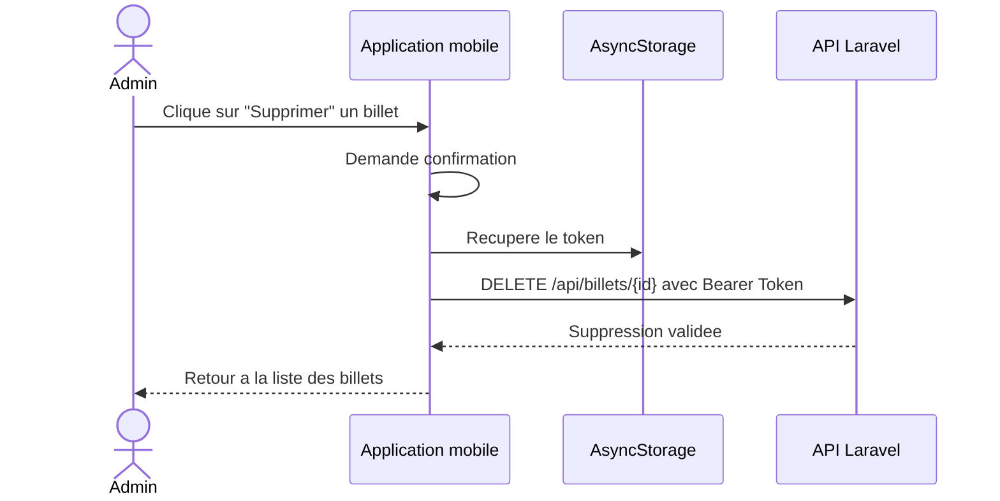
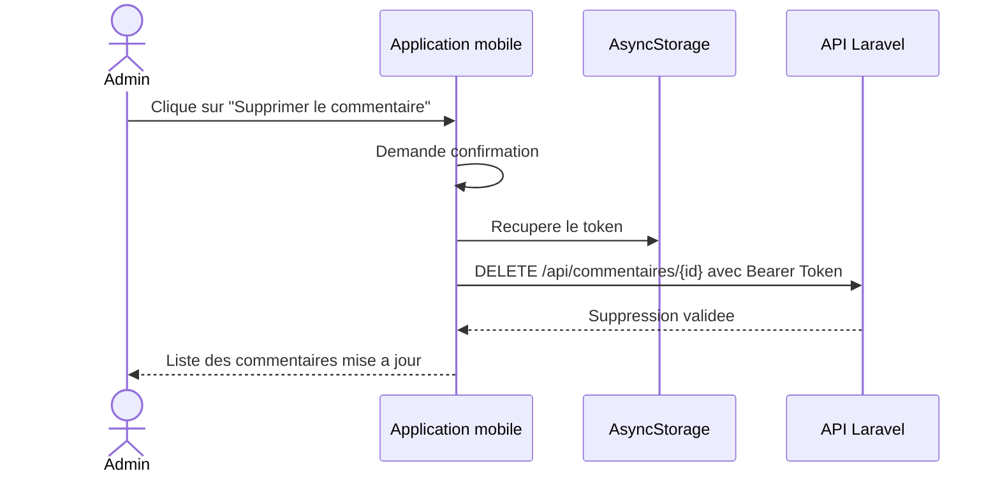
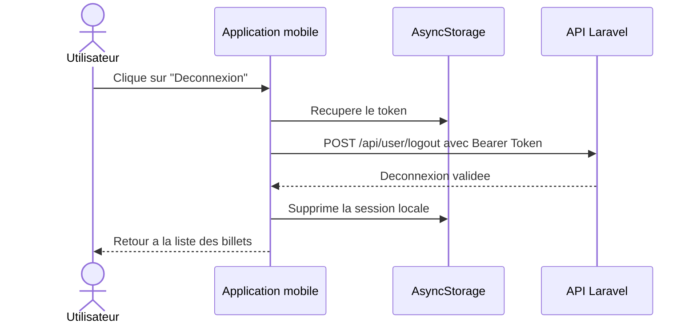

# Application mobile du blog Lyon Palme "B2LP"

Code de l'application mobile developpee avec Expo, React Native et TypeScript.

Cette application est un client mobile du blog Lyon Palme. Elle permet aux
adherents du club de consulter les billets, de lire les commentaires associes
apres connexion, et de commenter les billets.

Elle communique avec le webservice Laravel `API_B2LP`.

Mise a jour Juin 2026.

## 1. Presentation

L'application B2LP est la version mobile du front du blog Lyon Palme.

Elle permet :

- aux visiteurs de consulter la liste des billets et leur contenu ;
- aux visiteurs d'etre invites a se connecter lorsqu'ils veulent lire les commentaires ;
- aux adherents connectes de lire les commentaires ;
- aux adherents connectes d'ajouter un commentaire ;
- a l'administrateur de creer, modifier et supprimer des billets ;
- a l'administrateur de supprimer des commentaires.

La gestion des donnees est faite par l'API Laravel. Le mobile se charge surtout
de l'affichage, de la navigation, des formulaires et de la conservation de la
session utilisateur.

## 2. Technologies utilisees

- Expo SDK 54
- React Native
- React
- TypeScript
- Expo Router
- Axios
- AsyncStorage
- API Laravel avec authentification par Bearer Token

Le projet utilise des styles React Native classiques avec `StyleSheet`.
NativeWind/Tailwind n'est pas utilise dans cette version pour garder le projet
simple et stable sur telephone.

## 3. Installation du projet

Cloner le projet :

```bash
git clone <url-du-repo-mobile>
cd projetB2LP_Native
```

Installer les dependances :

```bash
npm install
```

Si besoin, creer une variable d'environnement pour changer l'URL de l'API :

```bash
EXPO_PUBLIC_API_BASE_URL=https://monblog.cherifhammani.fr/api
```

Si cette variable n'est pas definie, l'application utilise deja cette URL par
defaut dans `components/types.ts`.

## 4. Lancement en developpement

Demarrer Expo avec un tunnel, pratique pour tester sur telephone :

```bash
npm run start:tunnel
```

Ensuite :

- installer l'application Expo Go sur le telephone ;
- scanner le QR code affiche dans le terminal ;
- garder le terminal ouvert pendant le test.

Si Expo Go affiche une erreur de connexion au serveur de developpement, il faut
relancer la commande et scanner un nouveau QR code.

Pour un test avec cache nettoye :

```bash
npm run start:clear
```

## 5. Commandes utiles

```bash
npm start
npm run start:clear
npm run start:tunnel
npm run android
npm run ios
npm run web
npx tsc --noEmit
npx expo install --check
```

## 6. Application installable

L'application React Native est un client lourd : l'objectif final est de pouvoir
l'installer sur telephone.

Pendant le developpement, Expo Go suffit pour tester rapidement. Pour fournir
une application installable, il faut generer un fichier de build.

### Android

Sur Android, on peut generer une APK installable.

Exemple avec EAS Build :

```bash
npm install -g eas-cli
eas login
eas build:configure
eas build --platform android --profile preview
```

Exemple de configuration `eas.json` pour obtenir une APK :

```json
{
  "build": {
    "preview": {
      "distribution": "internal",
      "android": {
        "buildType": "apk"
      }
    }
  }
}
```

Apres la build, Expo fournit un lien de telechargement. Sur Android, il est
possible de telecharger le fichier `.apk`, puis de l'installer sur le telephone
apres confirmation de securite.

### iPhone

Sur iPhone, il n'y a pas d'APK. Le format iOS est plutot `.ipa`.

La solution gratuite la plus simple pour une demonstration est Expo Go :

- installation gratuite depuis l'App Store ;
- scan du QR code ;
- aucun compte Apple Developer obligatoire.

Pour une vraie application iPhone installable sans Expo Go, les solutions
propres passent generalement par :

- TestFlight ;
- l'App Store ;
- une distribution interne iOS.

Ces solutions demandent normalement un compte Apple Developer. Avec un Mac et
Xcode, il est possible d'installer une app sur son propre iPhone avec un Apple
ID gratuit, mais ce n'est pas une solution de distribution propre : c'est limite
et temporaire.

Pour un projet de jury, la solution conseillee est donc :

```txt
Android : APK avec EAS Build
iPhone  : Expo Go pour la demonstration gratuite
iPhone installable reel : Apple Developer + TestFlight ou distribution interne
```

## 7. Fonctionnement general

Le fichier `components/api.ts` centralise tous les appels vers l'API Laravel.

Les principales fonctions sont :

- `fetchBillets()` : recupere la liste des billets ;
- `fetchBillet(id)` : recupere le detail d'un billet avec ses commentaires ;
- `loginUser(email, password)` : connecte un utilisateur ;
- `registerUser(name, email, password)` : cree un compte utilisateur ;
- `createBillet()` : cree un billet ;
- `updateBillet()` : modifie un billet ;
- `deleteBillet()` : supprime un billet ;
- `createCommentaire()` : ajoute un commentaire ;
- `deleteCommentaire()` : supprime un commentaire.

La session utilisateur est geree dans `components/AuthProvider.tsx`.

Sur mobile, on n'utilise pas `localStorage` ou `sessionStorage`.
La session est stockee avec `AsyncStorage`, qui est l'equivalent adapte a React
Native.

Le token recu lors de la connexion est envoye dans les requetes protegees avec
l'en-tete HTTP suivant :

```txt
Authorization: Bearer <token>
```

## 8. Gestion des roles

Visiteur :

- peut voir la liste des billets ;
- peut lire le titre et le contenu des billets ;
- ne peut pas lire les commentaires ;
- ne peut pas commenter ;
- ne peut pas administrer les billets.

Adherent connecte :

- peut voir les billets ;
- peut lire les commentaires ;
- peut ajouter un commentaire.

Administrateur :

- peut voir les billets ;
- peut lire les commentaires ;
- peut ajouter un commentaire ;
- peut creer, modifier et supprimer des billets ;
- peut supprimer des commentaires.

Le vrai controle des droits est fait cote API Laravel.
Le front gere surtout l'affichage et la navigation selon l'utilisateur connecte.

## 9. Structure principale du projet

```txt
app/
  index.tsx                         Liste des billets
  login.tsx                         Page de connexion
  register.tsx                      Page d'inscription
  billets/[id].tsx                  Detail d'un billet et commentaires
  admin/billets/new.tsx             Creation d'un billet
  admin/billets/[id]/edit.tsx       Modification d'un billet
  _layout.tsx                       Navigation generale avec Expo Router

components/
  api.ts                            Appels vers l'API Laravel
  AuthProvider.tsx                  Gestion de la session utilisateur
  AppHeader.tsx                     En-tete de l'application
  BilletArticle.tsx                 Affichage d'un billet
  BilletEditor.tsx                  Formulaire de creation/modification
  CommentSection.tsx                Affichage et ajout des commentaires
  types.ts                          Types TypeScript
  ui.tsx                            Couleurs, boutons et styles communs
```

## 10. Diagrammes de sequence

### Consultation des billets par un visiteur



### Connexion d'un adherent



### Lecture et ajout d'un commentaire



### Creation ou modification d'un billet par l'administrateur



### Suppression d'un billet par l'administrateur



### Suppression d'un commentaire par l'administrateur



### Deconnexion



## 11. API utilisee

L'application utilise le webservice Laravel suivant :

```txt
https://monblog.cherifhammani.fr/api
```

Routes principales utilisees :

```txt
GET    /api/billets
GET    /api/billets/{id}
POST   /api/login
POST   /api/register
POST   /api/user/logout
POST   /api/commentaires
DELETE /api/commentaires/{commentaire}
POST   /api/billets
PATCH  /api/billets/{billet}
DELETE /api/billets/{billet}
```

Les routes suivantes necessitent un Bearer Token :

```txt
GET    /api/billets/{id}
POST   /api/user/logout
POST   /api/commentaires
DELETE /api/commentaires/{commentaire}
POST   /api/billets
PATCH  /api/billets/{billet}
DELETE /api/billets/{billet}
```

## 12. Points importants React Native

React Native ressemble a React, mais il y a quelques differences importantes :

- pas de balises HTML comme `div`, `p` ou `img` ;
- on utilise `View`, `Text`, `Image`, `TextInput`, `Pressable` ;
- le style se fait avec des objets JavaScript, souvent avec `StyleSheet.create()` ;
- il n'y a pas de DOM ni de navigateur classique ;
- pour stocker une session, on utilise `AsyncStorage` au lieu de `localStorage` ;
- la navigation est geree ici par Expo Router ;
- pour tester sur telephone, on utilise Expo Go et un serveur Expo ;
- certains comportements changent entre iOS, Android et web ;
- les images locales doivent etre importees avec `require()` ;
- les appels API avec Axios fonctionnent comme dans React web.

## 13. Tests et verification

Avant de rendre ou presenter le projet, lancer :

```bash
npx expo install --check
npx tsc --noEmit
```

Pour verifier que le bundle iOS se construit :

```bash
npx expo export --platform ios
```

Pour verifier que le bundle Android se construit :

```bash
npx expo export --platform android
```

## 14. Lien avec le webservice

Le front mobile depend du webservice Laravel `API_B2LP`.

Repo du webservice :

```txt
https://github.com/cherif74hmxi/API_B2LP
```
